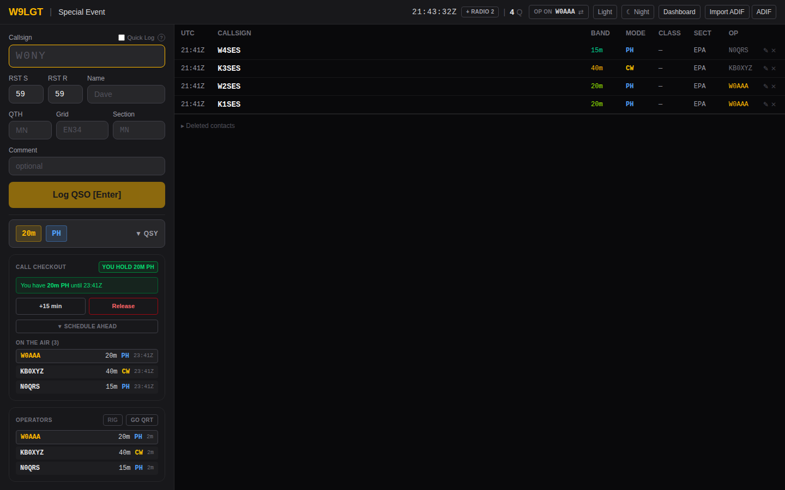
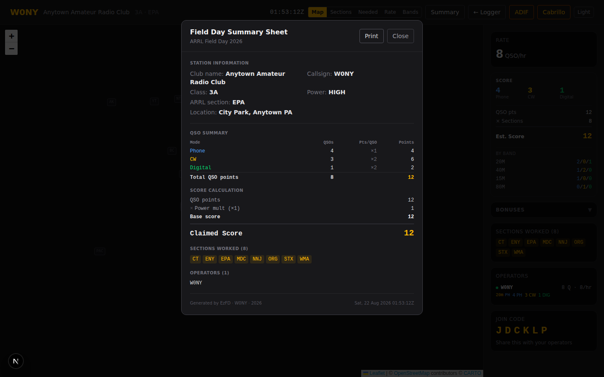
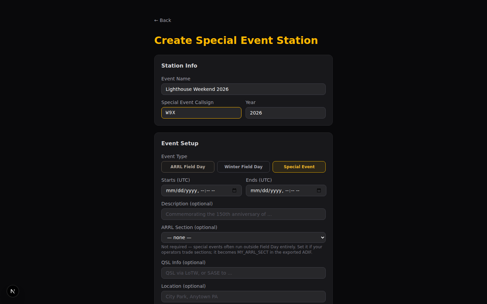
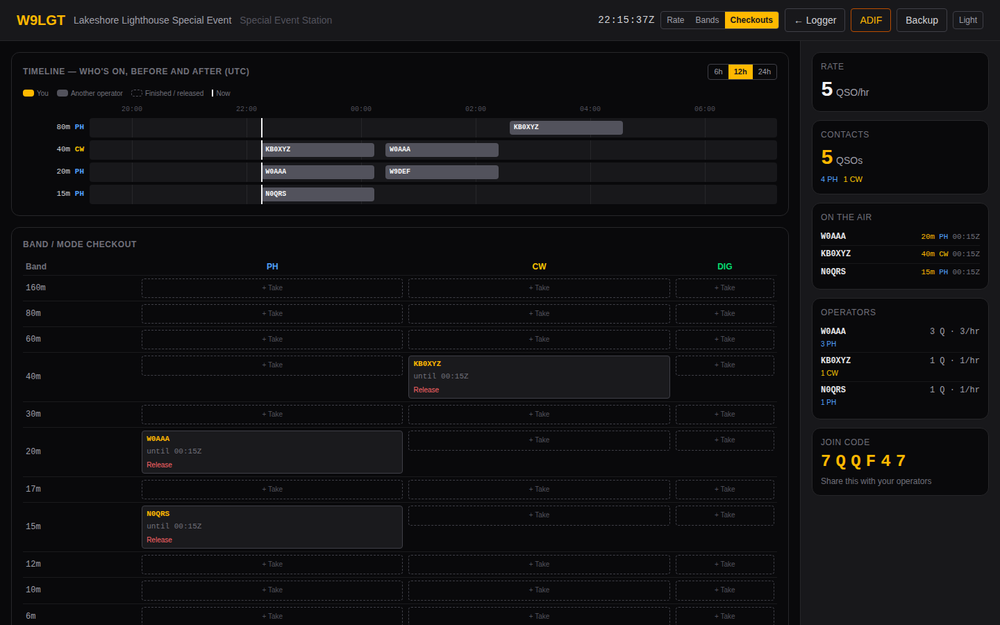

# EzFD

> **⚠️ Vibe-coded disclaimer:** This project was built entirely with AI assistance (Claude). It works, but the code may contain rough edges, non-idiomatic patterns, or choices a seasoned developer would raise an eyebrow at. Use it, hack it, improve it — but don't cite it as a reference implementation for anything critical. You have been warned.

A self-hosted, real-time, multi-operator logger for **ARRL Field Day**,
**Winter Field Day**, and **special event stations**.

Every operator logs into one shared log. Every QSO appears on every other
device within milliseconds. When the network drops — and at a Field Day site
it will — logging carries on locally and syncs when it comes back.

**Just operating?** [Quick start](docs/quick-start.md) — you have a join
code and a radio, and five minutes. **Setting the event up?**
[Getting started](docs/getting-started.md) covers install through to the
final backup.

**[Full documentation](docs/)** — and the same guides ship inside the app,
so they work on a field server with no internet.

<p align="center">
  
</p>

---

## What it does

**One log, many operators.** Operators join with a six-character code and
their callsign. No accounts, no setup per person. QSOs propagate live over
PostgreSQL `pg_notify` and Server-Sent Events, so duplicate checking and band
conflicts are accurate the moment someone else logs.

**Built for operating at speed.** Enter moves through the exchange and logs;
Tab wraps back to the callsign rather than escaping into the page. Callsign
lookups prefill from QRZ, the N1MM call history file and `MASTER.SCP`, without
ever overwriting something you typed. Night mode dims to 35% for the overnight
shift.

**Offline by design, not as an afterthought.** QSOs are written to local
storage first and sent second, in every window that logs — the main tab, the
CW popout, and the WSJT-X relay, which spools to disk. The queue drains itself
when the link returns, when the real-time stream reconnects, or on a backing-off
retry. That last part matters: a server restart leaves your own network up, so
"back online" is not a signal you can wait for. A flaky link, or a server that
goes away mid-run, costs you nothing.

**Radios if you want them.** A local Python bridge connects any
Hamlib-supported rig, so band and mode follow the VFO. If the rig supports CAT
keying, a popout window gives F1–F12 macros, Run/S&P sets, adjustable auto-CQ
and ESM. The server is never involved.

**Digital modes.** WSJT-X and JTDX log straight into EzFD over a small relay,
or bulk-import any ADIF file. Imports are idempotent, so re-importing can't
double your log.

**Correct scoring.** QSO points × power multiplier + bonuses, with all 19
Field Day bonus categories from rule 7.3 tracked live and each labelled with
its rule number. Sections neither multiply the score nor earn a bonus —
a detail that's easy to get wrong and expensive when you do.

**Special event stations.** A third event type for a callsign activated across
many operators and locations. Each operator's own grid and state follow their
contacts into the exported ADIF, which is what LoTW needs from a station
operated from several places. One operator can run two radios at once, as two
logging windows.

**Band and mode coordination, enforced.** A slot is checked out for a band and
mode, and a database constraint makes overlapping checkouts impossible — one
signal per band per mode, enforced rather than merely intended. On a special
event the holder is an operator; on Field Day it's a station, because station 2
holds 20m phone whoever is sitting at it.

**Exports that go where you need them.** ADIF for LoTW and QRZ, Cabrillo for
ARRL submission, a printable summary worksheet, and per-operator or
date-filtered ADIF slices.

<table>
<tr>
<td width="50%">
  <br>
  <sub>Live dashboard — section map, score, and every operator's rate on a second screen</sub>
</td>
<td width="50%">
  <br>
  <sub>Special event call checkout — one signal per band/mode, enforced by the database</sub>
</td>
</tr>
<tr>
<td width="50%">
  <br>
  <sub>Printable ARRL summary sheet — QSO totals, score calculation, bonuses and sections</sub>
</td>
<td width="50%">
  <br>
  <sub>One event type for Field Day, Winter Field Day, or a special event station</sub>
</td>
</tr>
<tr>
<td width="50%" colspan="2">
  <br>
  <sub>The checkout board — a timeline of who's on before and after, and a live band/mode grid to claim from</sub>
</td>
</tr>
</table>

---

## Quick start

On a fresh Ubuntu or Debian machine with a DNS record pointing at it:

```bash
# git clone https://github.com/nreed97/EzFD.git /opt/ezfd-src
# cd /opt/ezfd-src
# bash deploy.sh
```

That installs Node, PostgreSQL, nginx and certbot, applies the schema, builds
the app, provisions TLS and registers a systemd service. Re-running it is the
update path and preserves your configuration.

Then open the site, create an event, and share the join code.

→ [Getting started](docs/getting-started.md) · [Deployment](docs/deployment.md)

## Running it locally

```bash
$ npm install
$ createdb ezfd && psql -d ezfd -f db/schema.sql
$ echo 'DATABASE_URL=postgres://localhost:5432/ezfd' > .env.local
$ npm run dev
```

→ [Development](docs/development.md)

---

## Documentation

**Operating**
[Quick start](docs/quick-start.md)

**Running an event**
[Getting started](docs/getting-started.md) ·
[Operating](docs/operating.md) ·
[Field Day](docs/field-day.md) ·
[Special event stations](docs/special-events.md) ·
[Rig control and CW](docs/rig-control.md) ·
[Digital modes](docs/digital-modes.md) ·
[Troubleshooting](docs/troubleshooting.md)

**Running the server**
[Deployment](docs/deployment.md) ·
[Administration](docs/administration.md) ·
[Configuration](docs/configuration.md)

**Working on the code**
[Development](docs/development.md) ·
[Architecture](docs/architecture.md) ·
[Database](docs/database.md) ·
[HTTP API](docs/api.md)

---

## Built with

Next.js 16 (App Router, standalone output) · React 19 · PostgreSQL 16 ·
Tailwind v4 · Leaflet · Hamlib

## Contributing

`AGENTS.md` documents the conventions and the accumulated gotchas — worth
reading before changing anything non-obvious. `npx tsc --noEmit`,
`npm run lint` and `npm run build` must all be clean; CI gates on those plus
`shellcheck`, and runs the section-list, scoring, ADIF, Cabrillo, schema,
query, restore and end-to-end suites.

When adding a test, break the thing it guards and watch it fail before
trusting it. That practice has already caught a bug the test was written to
prevent.

## License

```
GLWT (Good Luck With That) Public License
Copyright (c) 2026 Nick Reed (W0NY)

Everyone is permitted to copy, distribute, modify, merge, sell, publish,
sublicense, or do anything else with this software, with or without
modification, for any purpose.

THE SOFTWARE IS PROVIDED "AS IS", WITHOUT WARRANTY OF ANY KIND.
The author is not responsible if this software:
  - Causes you to miss a multiplier
  - Crashes at 0200Z on Field Day night
  - Logs your club's dupe count to the ARRL
  - Achieves sentience and starts logging QSOs autonomously
  - Otherwise ruins your Field Day

USE AT YOUR OWN RISK.

IN NO EVENT SHALL THE AUTHORS BE LIABLE FOR ANY CLAIM, DAMAGES, OR OTHER
LIABILITY ARISING FROM THE SOFTWARE OR ITS USE.

73 de W0NY — good luck out there.
```
