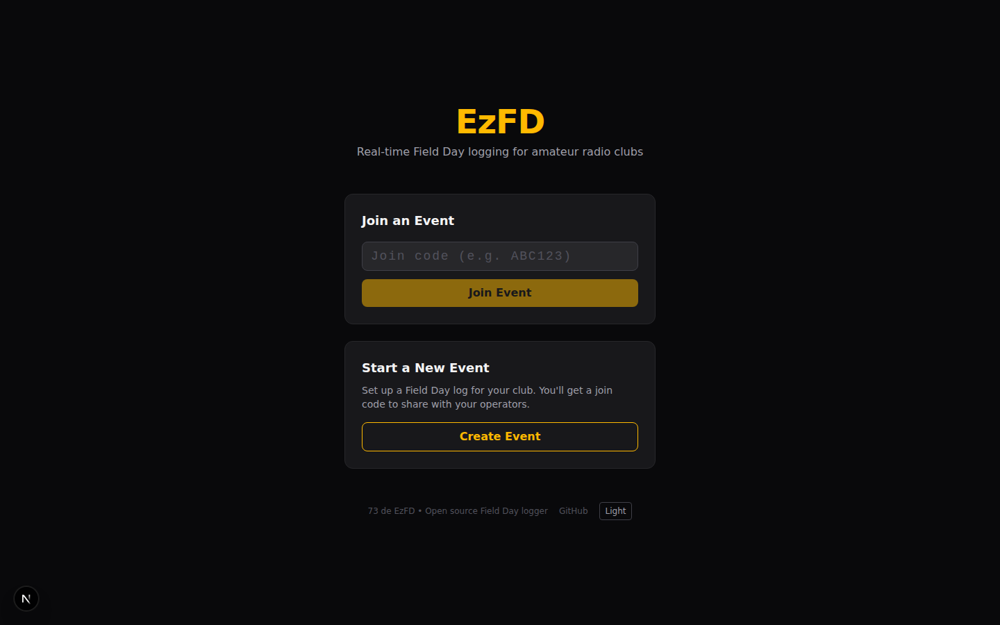
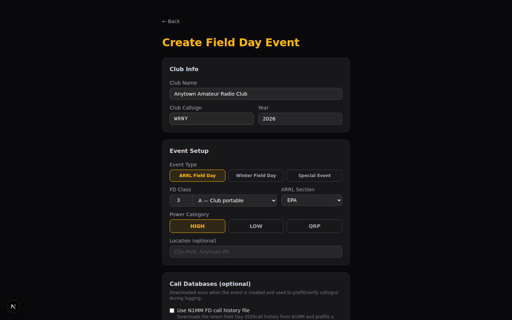
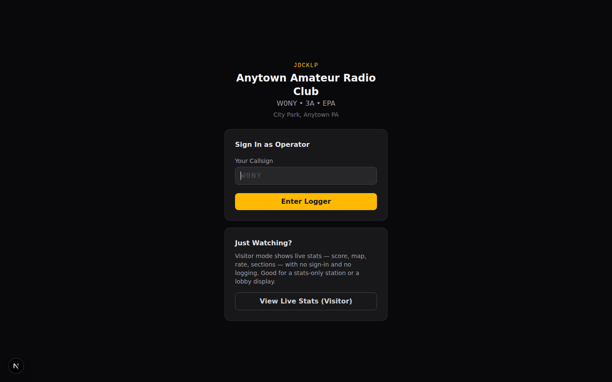

# Getting started

This walks from an empty server to a logged QSO and out the other side — the
whole path for whoever is standing the event up.

If someone else runs the server and you just want to operate, you don't need
any of the install half: read the [Quick start](quick-start.md) instead.



## Install the server

You need a Ubuntu or Debian machine with a public hostname pointing at it. A
1 GB VPS is enough; `deploy.sh` adds swap because `next build` will otherwise
be OOM-killed at that size.

```bash
# git clone https://github.com/nreed97/EzFD.git /opt/ezfd-src
# cd /opt/ezfd-src
# bash deploy.sh
```

The script asks for a domain and an email for the TLS certificate, then
installs Node, PostgreSQL, nginx and certbot, creates the database, applies
the schema, builds the app, and registers a systemd service. Full detail in
[Deployment](deployment.md).

When it finishes, the app is at `https://your-domain`.

To try it locally instead, see [Development](development.md).

## Create an event

Open the site and choose **Create Event**. The form branches on the event type
you pick, because the three types genuinely differ:

| Type | Use it for | Key fields |
|---|---|---|
| **ARRL Field Day** | The June contest | Class (e.g. `3A`), ARRL section, power category |
| **Winter Field Day** | The January contest | Class with the WFD letters (`H`/`O`/`I`), section, power |
| **Special Event** | A callsign activated over a date range, often by operators in different places | Date range, checkout rules, optional section |

Fill in the club or event name and the callsign that will be signed on the
air. Everything else has a working default.

Optional, and all safe to skip:

- **QRZ lookup** — a QRZ.com XML subscription auto-fills name and state as
  operators type a callsign. Credentials are encrypted at rest and shared by
  every operator on the event, so nobody needs their own.
- **Call databases** — the N1MM call history file prefills a known station's
  class and section; `MASTER.SCP` flags whether a callsign is recognised.
  Both download at event creation and are best-effort: a failed download
  degrades the hint, never blocks the event.
- **Admin key** — if the server sets `EZFD_ADMIN_KEY`, event creation requires
  it. See [Configuration](configuration.md).

Submitting gives you a **six-character join code**. That code is how operators
get in — there are no accounts.



## Joining an event

Operators go to the site, enter the join code, and type their own callsign.
That's the whole sign-in. The callsign identifies who logged each QSO; the
event's callsign is what goes on the air.



On a multi-transmitter Field Day entry — `2A` and up — operators also pick
**which station they're at**. That number rides on every QSO they log and
becomes the transmitter number in the Cabrillo submission, so getting it right
is the difference between a 3A entry that reads as three transmitters and one
that claims every contact came from the same rig.

On a special event, operators also enter their own grid and state, because a
distributed activation has one location per operator rather than one per
event. See [Special event stations](special-events.md).

There is also **Visitor mode** — read-only live stats, no callsign, no
logging. Good for a screen in the corner of the room.

## Log a QSO

The entry form is built for one-handed operation at speed:

1. Type the callsign. Press **Enter**.
2. Type the received exchange. **Enter** moves between fields.
3. **Enter** on the last field logs the QSO and returns focus to the callsign.

**Tab** from the last field wraps back to the callsign rather than escaping
into the rest of the page, so you never have to reach for the mouse.

The QSO appears immediately on every other operator's screen. If the network
is down it is written to local storage and syncs when connectivity returns —
nothing is lost, and you can keep logging.

[Operating](operating.md) covers the rest of the screen: band and mode
switching, duplicate handling, band conflicts and the score display.

## While it runs

Open the **Dashboard** on a spare screen. It is read-only and updates live —
score, rate, sections worked, and who is on which band.


**Visitor mode** is the same view with no callsign and no ability to log, for
a screen visitors can see.

On a special event the dashboard gets a **Checkouts** tab instead of the
section views: a timeline of who holds which band and mode, over a grid to
claim from. See [Special event stations](special-events.md#the-whole-schedule-on-the-dashboard).

## Finish the event

From the dashboard:

- **ADIF** — for LoTW, QRZ Logbook, or any log manager.
- **Cabrillo** — for ARRL contest submission (Field Day and Winter Field Day
  only; a special event has no contest to submit to).
- **Summary** — a printable worksheet mirroring the ARRL entry form.

Read the summary sheet before you submit anything — it is the worksheet you
transcribe onto the ARRL entry, and it shows the score calculation rather than
just the total.


Then back the event up before you tear anything down. **Backup** on the
dashboard downloads the whole event as one JSON file — every contact, the
roster, the checkouts, and the deleted contacts too — and it restores into any
EzFD instance from the home page. That is also how you move an event off a
field server.

The same backup is available from the server shell, which is the better option
if the event is large or the browser is far away:

```bash
# bash ezfd-admin.sh      # → List / manage events → Export full backup
```

See [Administration](administration.md).

## Next steps

- Connect a radio so band and mode follow the VFO: [Rig control](rig-control.md)
- Auto-log FT8: [Digital modes](digital-modes.md)
- Understand scoring before you rely on it: [Field Day](field-day.md)
