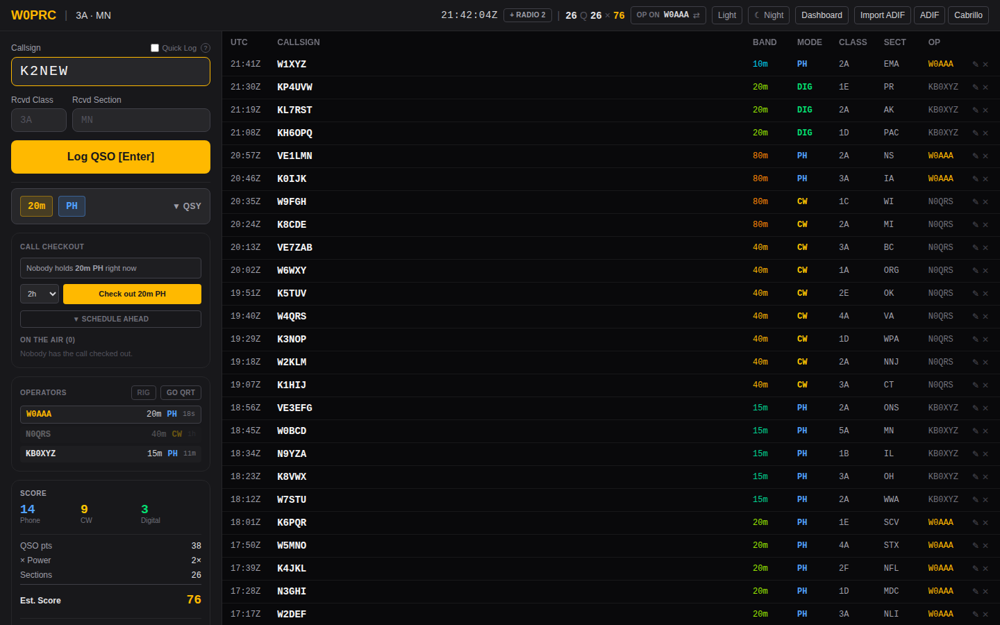
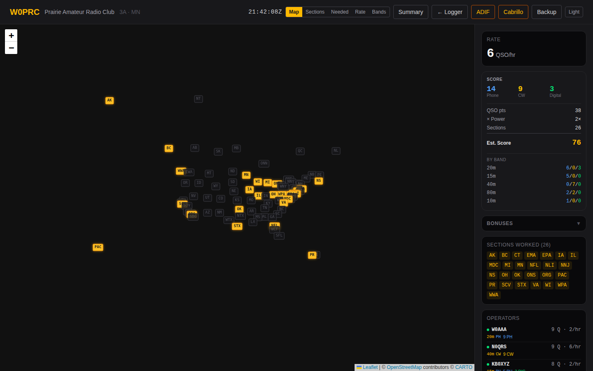

# Operating

The logging screen. Everything here applies to all three event types unless
noted; the exchange fields differ, which is covered per type in
[Field Day](field-day.md) and [Special event stations](special-events.md).

## The entry form

Focus starts in the callsign field and returns there after every logged QSO.
The keyboard path is designed so a run never requires the mouse:

| Key | Where you are | What happens |
|---|---|---|
| `Enter` | Callsign | Move to the first exchange field |
| `Enter` | An exchange field | Move to the next one |
| `Enter` | The last field | Log the QSO, clear, focus the callsign |
| `Tab` | The last field | Wrap to the callsign, not the next page control |

That `Tab` behaviour is deliberate. The browser default would move focus into
the band buttons and out of the form entirely, which at 4 AM is how you end up
typing a callsign into nothing.

### Hints while you type

After three characters, the app looks the callsign up in whatever sources the
event enabled. Everything here is advisory — none of it blocks logging:

- **QRZ** — name, state, country, if the event has credentials.
- **Call history** — that station's usual class and section, from the N1MM
  file. Prefills the exchange fields, but only ones you haven't typed into
  yourself.
- **MASTER.SCP** — a `✓ known callsign` marker if the call is in the Super
  Check Partial list.
- **Unusual format** — a warning if the callsign doesn't look like a callsign
  (no digit, no letter, too short). Plenty of real calls trip this; it's a
  prompt to double-check, not a refusal.

Lookups are debounced and the reply is checked against the callsign still in
the field, so a slow response can't prefill the *next* station's QSO.

## Band and mode

The **QSY** drawer holds a band grid and a mode selector. The collapsed button
always shows the current band and mode, so a glance confirms where you are.

- Bands: 160m through 70cm, plus SAT.
- Modes: `PH` (phone), `CW`, `DIG` (anything digital).
- An orange dot on a band tile means another active operator is on it. Hover
  for who.

If a radio is connected, band and mode follow the VFO automatically and you
can ignore this entirely — see [Rig control](rig-control.md).

## Duplicates

The server decides authoritatively; the form shows a heads-up as you type.
What counts as a duplicate depends on the event's **dupe rule**:

| Rule | A duplicate is | Typical use |
|---|---|---|
| `EVENT` | The same callsign on the same band and mode, at any point in the event | Field Day, Winter Field Day |
| `DAY` | The same callsign on the same band and mode, on the same UTC day | A special event running over weeks |
| `NONE` | Nothing is ever flagged | Events that don't care |

Duplicates are **logged, not rejected**. They're marked, excluded from
scoring, and excluded from exports. Refusing them outright would lose the
record of a contact that actually happened.

## Who else is on

The **Operators** panel lists everyone currently signed in, with their band,
mode, and time since their last QSO.

- A red row and a `!` mean someone else is on your band and mode.
- Operators idle more than 15 minutes grey out and stop counting toward
  conflicts, so a forgotten tab doesn't permanently block a band.
- **Go QRT** removes you from the list immediately rather than waiting for the
  timeout. Use it when you step away.

This panel is supplemented by **Call Checkout**, which is authoritative about
who may transmit. On a special event a slot is held by an *operator* — see
[Special event stations](special-events.md). On Field Day it is held by a
*station*, because station 2 holds 20m phone whoever is sitting at it; claiming
is optional there, so a club that never opens the panel is never warned. Either
way the rule is the same one the rules impose: one signal per band and mode.

## Working offline

QSOs are written to browser local storage *first*, then sent to the server.
If the send fails the QSO stays queued, the header shows a pending count, and
logging continues normally. A queued QSO shows as `Queued — syncing…` until the
server confirms it.

The queue drains by itself, on whichever of these comes first:

- the browser regaining connectivity;
- the real-time stream reconnecting, which is the earliest sign the *server* is
  back — usually a second or two after it returns;
- a retry timer at 5s, 10s, 20s, 40s and then every minute.

You can also click the pending badge to retry immediately, but you shouldn't
need to. That last point matters more than it looks: a server restart or an
nginx reload leaves your own network up, so the browser never sees a
connectivity change. The retry and the stream reconnect are what cover it.

Three consequences worth knowing:

- **Nothing is lost to a flaky link, or to the server going away.** This is the
  point of the design. It holds in the CW window too, and in the WSJT-X relay,
  which spools to a file on disk.
- **Replayed QSOs bypass the special-event checkout gate.** By the time the
  browser reconnects the reservation has expired, and the contact already
  happened on the air. Dropping it would only lose the record.
- **A queued QSO is timestamped when the server accepts it**, not when you
  logged it, because the server stamps every contact from one clock. A long
  outage therefore shifts those times.

## Editing and deleting

The QSO table supports inline editing of callsign, band, mode and exchange.
Duplicate status is re-evaluated after an edit. Deleting a QSO removes it
everywhere in real time.

A queued QSO that hasn't synced yet can be deleted locally — it never reaches
the server.

Deleting doesn't destroy anything. There is no authentication here beyond the
join code, so anyone can delete any contact, and a log that couldn't answer
"what happened to that QSO?" would make an accident indistinguishable from a
contact never logged. A deleted contact leaves the live log, the exports and
the score, and moves to **Deleted contacts** below the table, with who deleted
it. **Restore** puts it back.

## Night mode

One click dims the interface to 35% brightness with a warm tone, to preserve
dark adaptation on an overnight shift. It's separate from the light/dark theme
toggle and persists across sessions.

## Reading the header

| Element | Meaning |
|---|---|
| `147 Q` | Non-duplicate QSOs |
| `31 ×` | Sections worked (contest events only) |
| Amber number | Score before bonuses (contest events only) |
| `OFFLINE` | The browser has lost connectivity |
| `3 pending ↑` | QSOs queued locally, click to retry |
| `● RIG 14.250` | A radio is connected; click for details |
| `⚡ CW` | The rig supports CAT keying; opens the macro window |

A special event shows only the QSO count — there is no contest score.

## The dashboard

A separate read-only view for a second screen:

- **Map** — worked sections plotted geographically
- **Sections** / **Needed** — grid of sections worked and the hunt list
- **Rate** — QSOs per hour, with gaps visible
- **Bands** — band × mode matrix
- **Operators** — per-operator totals, rate, and current band/mode
- **Summary** — printable ARRL-style worksheet

Special events show Rate, Bands, Operators and a live **On The Air** list
instead of the section-based views, which don't apply.
