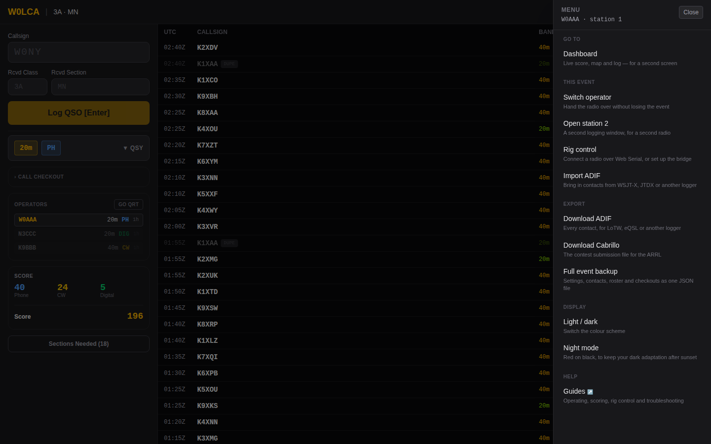
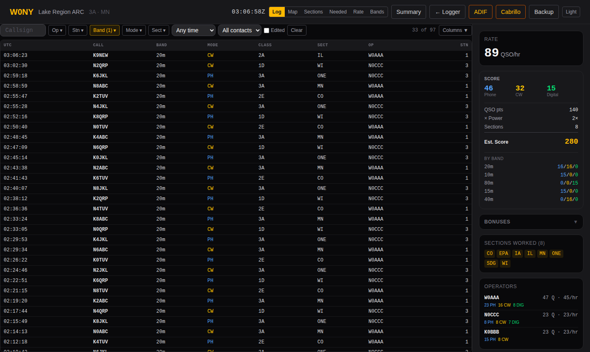
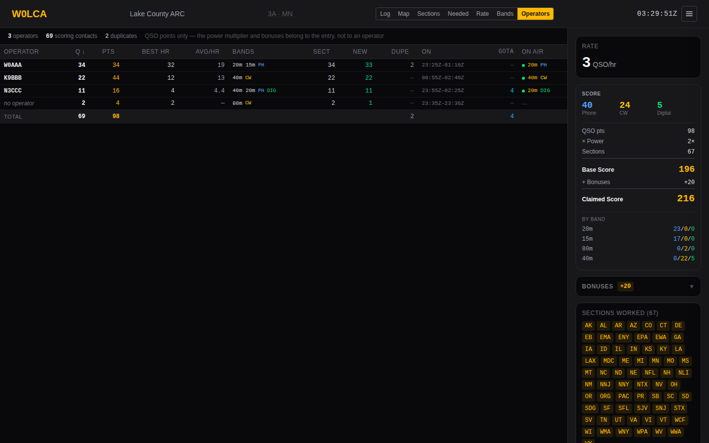

# Operating

The logging screen. Everything here applies to all three event types unless
noted; the exchange fields differ, which is covered per type in
[Field Day](field-day.md) and [Special event stations](special-events.md).

## Getting to the logger

Signing in asks two questions: your callsign, then where you're operating. The
second shows every band and mode with what's free, what somebody is on, and
what somebody has checked out — so you choose a position knowing the answer
rather than finding out from the band activity panel afterwards.

The band and mode you pick is where the entry form opens. Checking out is
offered on the same screen and is optional on a contest; on a special event it
is the point. See [the quick start](quick-start.md#pick-where-youre-operating)
for the colour coding.

The board is live. A checkout made anywhere else — another operator, another
station, the coordination panel in someone's logging window — appears while
you are looking at it, so the band you are about to take cannot quietly become
somebody else's between the screen loading and your click. Who is *on air*
without a checkout is refreshed every 15 seconds instead, which is as fast as
a logging window reports itself.

A position may already be selected when the screen opens — a band you have
checked out, or failing that the one this browser was last logging on. The
screen says which of the two it used, and never preselects a band somebody
else has checked out: you can still choose one, but not by default. It is a guess at where you are about to
sit, not a decision: clicking any other band replaces it. The memory is kept
per event and per station, and outlives signing out on purpose, because the
laptop stays at the radio while the operators rotate through it.

Returning to an event in the same browser session skips both steps and goes
straight back to the logger, on the band and mode you were last on — QSY
included, so a reload mid-shift lands where you actually are rather than where
you started. Change band from the **QSY** drawer once you're in.

## The entry form

Focus starts in the callsign field and returns there after every logged QSO.
The keyboard path is designed so a run never requires the mouse:

| Key | Where you are | What happens |
|---|---|---|
| `Enter` | Callsign | Move to the first exchange field |
| `Enter` | An exchange field | Move to the next one |
| `Enter` | The last field | Log the QSO, clear, focus the callsign |
| `Tab` | The last field | Wrap to the callsign, not the next page control |

That `Tab` behaviour is deliberate. The browser default would move focus into
the band buttons and out of the form entirely, which at 4 AM is how you end up
typing a callsign into nothing.

### Hints while you type

After three characters, the app looks the callsign up in whatever sources the
event enabled. Everything here is advisory — none of it blocks logging:

- **QRZ** — name, state, country, if the event has credentials.
- **Call history** — that station's usual class and section, from the N1MM
  file. Prefills the exchange fields, but only ones you haven't typed into
  yourself.
- **MASTER.SCP** — a `✓ known callsign` marker if the call is in the Super
  Check Partial list.
- **Unusual format** — a warning if the callsign doesn't look like a callsign
  (no digit, no letter, too short). Plenty of real calls trip this; it's a
  prompt to double-check, not a refusal.

Lookups are debounced and the reply is checked against the callsign still in
the field, so a slow response can't prefill the *next* station's QSO.

## Band and mode

The **QSY** drawer holds a band grid and a mode selector. The collapsed button
always shows the current band and mode, so a glance confirms where you are.

- Bands: 160m through 70cm, plus SAT.
- Modes: `PH` (phone), `CW`, `DIG` (anything digital).
- An orange dot on a band tile means another active operator is on it. Hover
  for who.

If a radio is connected, band and mode follow the VFO automatically and you
can ignore this entirely — see [Rig control](rig-control.md).

## Duplicates

The server decides authoritatively; the form shows a heads-up as you type.
What counts as a duplicate depends on the event's **dupe rule**:

| Rule | A duplicate is | Typical use |
|---|---|---|
| `EVENT` | The same callsign on the same band and mode, at any point in the event | Field Day, Winter Field Day |
| `DAY` | The same callsign on the same band and mode, on the same UTC day | A special event running over weeks |
| `NONE` | Nothing is ever flagged | Events that don't care |

Duplicates are **logged, not rejected**. They're marked, excluded from
scoring, and excluded from exports. Refusing them outright would lose the
record of a contact that actually happened.

## Who else is on

The **Operators** panel lists everyone currently signed in, with their band,
mode, and time since their last QSO.

- A red row and a `!` mean someone else is on your band and mode.
- Operators idle more than 15 minutes grey out and stop counting toward
  conflicts, so a forgotten tab doesn't permanently block a band.
- **Go QRT** removes you from the list immediately rather than waiting for the
  timeout. Use it when you step away.

This panel is supplemented by **Call Checkout**, which is authoritative about
who may transmit. On a special event a slot is held by an *operator* — see
[Special event stations](special-events.md). On Field Day it is held by a
*station*, because station 2 holds 20m phone whoever is sitting at it; claiming
is optional there, so a club that never opens the panel is never warned. Either
way the rule is the same one the rules impose: one signal per band and mode.

## Working offline

QSOs are written to browser local storage *first*, then sent to the server.
If the send fails the QSO stays queued, the header shows a pending count, and
logging continues normally. A queued QSO shows as `Queued — syncing…` until the
server confirms it.

The queue drains by itself, on whichever of these comes first:

- the browser regaining connectivity;
- the real-time stream reconnecting, which is the earliest sign the *server* is
  back — usually a second or two after it returns;
- a retry timer at 5s, 10s, 20s, 40s and then every minute.

You can also click the pending badge to retry immediately, but you shouldn't
need to. That last point matters more than it looks: a server restart or an
nginx reload leaves your own network up, so the browser never sees a
connectivity change. The retry and the stream reconnect are what cover it.

Three consequences worth knowing:

- **Nothing is lost to a flaky link, or to the server going away.** This is the
  point of the design. It holds in the CW window too, and in the WSJT-X relay,
  which spools to a file on disk.
- **Replayed QSOs bypass the special-event checkout gate.** By the time the
  browser reconnects the reservation has expired, and the contact already
  happened on the air. Dropping it would only lose the record.
- **A queued QSO is timestamped when the server accepts it**, not when you
  logged it, because the server stamps every contact from one clock. A long
  outage therefore shifts those times.

## Editing and deleting

The QSO table supports inline editing of callsign, band, mode and exchange.
Duplicate status is re-evaluated after an edit. Deleting a QSO removes it
everywhere in real time.

A queued QSO that hasn't synced yet can be deleted locally — it never reaches
the server.

Deleting doesn't destroy anything. There is no authentication here beyond the
join code, so anyone can delete any contact, and a log that couldn't answer
"what happened to that QSO?" would make an accident indistinguishable from a
contact never logged. A deleted contact leaves the live log, the exports and
the score, and moves to **Deleted contacts** below the table, with who deleted
it. **Restore** puts it back.

## Night mode

One click dims the interface to 35% brightness with a warm tone, to preserve
dark adaptation on an overnight shift. It's separate from the light/dark theme
toggle and persists across sessions.

## Reading the header

| Element | Meaning |
|---|---|
| `147 Q` | Non-duplicate QSOs |
| `31 ×` | Sections worked (contest events only) |
| Amber number | Score before bonuses (contest events only) |
| `OFFLINE` | The browser has lost connectivity |
| `3 pending ↑` | QSOs queued locally, click to retry |
| `Rig off` | No radio connected. Click to connect one |
| `● Rig 14.250` | A radio is connected, and what it is tuned to |
| `CW` | The rig can key CW — opens the macro and keying window |
| `☰` | The menu — everything else you can *do* |

A special event shows only the QSO count — there is no contest score.

The header is deliberately all **status**: things you read at a glance without
acting on them. Anything you click to make something happen is in the menu.

Which station this window is appears at the top of the menu, beside your
callsign, and only where the number can be wrong: a multi-transmitter entry,
where you chose it at sign-in, or any window opened with **Open station 2**. A
1A club on its only radio has nothing to confuse and does not see it. Check it
before you start a shift — every contact you log carries that transmitter
number into the Cabrillo export, and the export is where a wrong one used to
first show up. The CW keying window shows the same badge, which is what tells
two of them apart when you are running two radios.

## The menu

Everything you can *do* is behind **☰** in the top right, on the logger and the
dashboard alike, at every screen size. Each entry says what it is, because
"ADIF" and "Backup" both look like a download until something tells you which
is which.

| Group | Holds |
|---|---|
| **Go to** | The dashboard, or back to the logger |
| **This event** | Switch operator, open a second station, the CW window, rig details, Import ADIF |
| **Export** | ADIF for uploading, Cabrillo for submitting, and the full event backup |
| **Display** | Light/dark, and night mode |
| **Help** | These guides, in a new tab |

Entries appear based on what your event and your radio actually are, never on
the size of your screen. A special event is offered no Cabrillo file and no
ARRL summary sheet, because neither exists for one. The CW window appears only
when a rig that can key CW is connected. A read-only visitor is offered no
files at all.

**Escape closes it**, and the whole menu is reachable by keyboard: Tab moves
through it, Enter opens an entry, and focus returns to **☰** when it closes.

> **This used to be split across two rows of buttons that disagreed with each
> other.** Which controls you got depended on how wide your browser was, and
> not on purpose: the guides were reachable *only* on a phone, while Import
> ADIF, both exports and the second-radio window were reachable only at tablet
> width and up. If you have been logging from a phone and could not find the
> export, that is why — it is in the menu now.

## The dashboard

A separate read-only view for a second screen. It opens on the **Log**:

- **Log** — every contact, filterable, with the columns you choose
- **Map** — worked sections plotted geographically
- **Sections** / **Needed** — grid of sections worked and the hunt list
- **Rate** — QSOs per hour, with gaps visible
- **Bands** — band × mode matrix
- **Operators** — who worked what: contacts, rate, bands and sections
- **Summary** — printable ARRL-style worksheet

Special events show Log, Rate, Bands, Operators and a live **On The Air**
list instead of the section-based views, which don't apply.

### The Log view

The whole log in one table. Two things it is for: answering a question about
the log without exporting it mid-event, and putting a live log on a screen at
the site.

**Filters** combine. Pick any of them and the count beside the filter bar shows
what survived — `33 of 97` above. **Clear** appears once anything is active.

| Filter | Finds |
|---|---|
| Callsign | Any contact whose call contains what you type, so `K1AB` matches `K1ABC` and `K1ABC/P` |
| Op | One or more operators. Contacts with no operator recorded — an ADIF import — match only when this is off |
| Stn | Which radio logged it |
| Band · Mode · Sect | Only the values actually present in your log, not every possibility |
| Time | The last 15 minutes, hour, or four hours |
| Dupes | Show all, hide them, or show only the duplicates |
| Edited | Only contacts changed since they were logged — a reader for the audit trail |

Unrecognised sections are offered in the **Sect** filter alongside the real
ones. That is deliberate: a typo is exactly the thing you open this view to
find and correct, so filtering it out would defeat the purpose. Fix it from the
logging screen's log table, which is where editing lives.

**Columns** picks what to show. The defaults differ by event type — a contest
gets class and section, a special event gets RST, name and grid, because an SES
has no contest exchange and those columns would be empty on every row. Your
choice is remembered in that browser and does not affect anyone else, so the
laptop driving the projector can show a different set from the one at the
operating position. **Reset** puts the defaults back.

A contact logged while you are watching flashes briefly as it arrives, so a
projected log reads as live rather than as a static table that silently
changes. Nothing moves — only the background — and the flash is suppressed
entirely for anyone whose system asks for reduced motion.

The view is read-only. Editing and deleting stay in the logging screen, along
with the audit trail that records them.

### The Operators view

Who worked what, over the log you already have. Nothing here is recorded
separately or has to be turned on — every figure is read back out of the
contacts.

| Column | Is |
|---|---|
| **Q** | Scoring contacts. Duplicates are not in it |
| **Pts** | QSO points those contacts are worth — 1 a phone contact, 2 a CW or digital one |
| **Best hr** | The most contacts this operator made in any 60 minutes |
| **Avg/hr** | Contacts per hour from their first to their last. Blank until those span an hour |
| **Bands** | Every band they worked, and the modes |
| **Sect** | Sections they worked |
| **New** | Sections *nobody had reached yet* when they worked them |
| **Dupe** | Duplicates they logged. Not in Q, not in Pts |
| **On** | First and last contact, UTC |
| **On air** | Where their logging window says they are now, if they are signed in |

Click any heading to sort by it. A special event has no sections, so those two
columns are not shown on one.

**Best hr and Avg/hr are different questions and often different numbers.** An
operator who takes 60 in their first hour and then holds a quiet band for three
more has a best hour of 60 and an average of 15. The first describes the run,
the second describes the shift; neither is wrong, and the sidebar's Operators
panel shows the best hour.

**Avg/hr stays blank for the first hour.** A figure per hour needs an hour to
average over: divide two contacts by the four seconds between them and you get
1,800 an hour, which is not a rate anybody worked — it is a fraction of a
minute projected out to sixty. Best hr has no such problem, because it counts
what happened rather than extrapolating from it, and it is the number to read
early in a shift.

**New** is the column that says who *brought something in* rather than who did
the most. A section belongs to whoever reached it first, so every section in
your log is somebody's — the column adds up to the sections-worked total.

#### Reading the totals row

The row at the bottom is there to be checked. Its contacts and points should
match the scoreboard, and two things would otherwise stop them:

- **Contacts with no operator** get a row labelled `no operator` rather than
  being dropped. Those come from an ADIF import, which carries no operator
  callsign. It sorts last whatever you sort by, because it is a pile of
  contacts and not a person — and it is not counted in the operator count.
- **Duplicates** are counted, in their own column, and left out of everything
  else. Hiding them entirely would make an operator's row disagree with what
  the Log view shows for the same operator.

**Pts is not a score.** It is QSO points before anything is done to them. The
power multiplier is a property of your entry and a bonus is earned by the club,
so neither is split between people — adding the column up will not give you the
claimed score, and is not meant to.

Somebody signed in who has not logged anything yet gets a row saying so, so the
table shows everyone at the site rather than only the ones with contacts.
