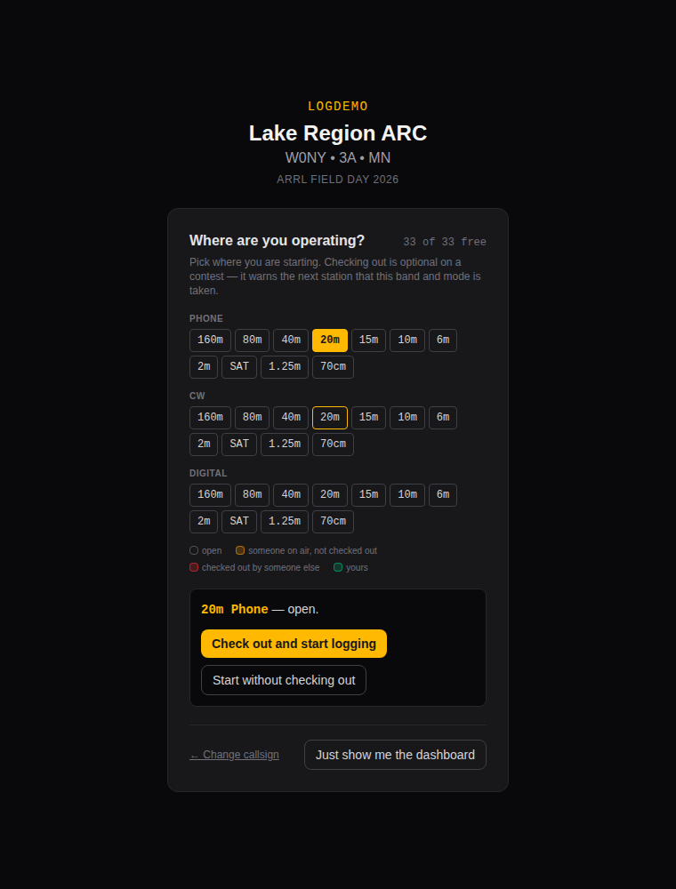

# Quick start

**For operators.** You have a join code and a radio, and somebody else is
running the server. This covers the five things you'll actually do: get in,
log a contact, change band, cope with a dropped network, and sign off.

If you're the one setting the event up, [Getting started](getting-started.md)
covers that end — installing the server, creating the event, and closing it
out afterwards.

## 1. Get in

Open the site, type the **join code**, and press **Join Event**.

Then type **your own callsign** — not the club's. That's the whole sign-in;
there are no accounts and no password. Your callsign is what records who
worked each contact.

Two things you may also be asked for:

- **Which station you're at**, on a multi-transmitter Field Day entry (`2A`
  and up). Pick the radio you're sitting at. It matters: that number becomes
  the transmitter number when the club submits.
- **Your grid and state**, on a special event. Each operator has their own
  location, so this can't come from the event.

## Pick where you're operating

Next you're asked where you're sitting. Bands are laid out by mode and
colour-coded:

| Colour | Meaning |
|---|---|
| Plain | Free |
| Amber | Somebody is logging there but hasn't claimed it |
| Red | Somebody has claimed it |
| Green | You have claimed it |

On a special event what is being claimed is the shared callsign, and the
screen says **check out** rather than claim — see
[Special event stations](special-events.md). Everything below works the same
way either way.

One may already be picked for you, with a line underneath saying why:

- **You have it claimed.** Your booking for this shift, which is the whole
  reason for claiming in the first place.
- **This radio was last on it.** Where this browser was logging before —
  usually the rig in front of you, since a club's laptop stays at its radio
  while the operators rotate through.

A claim wins where both apply, and a band somebody *else* holds is never
offered this way. Either way it is only a starting guess: click any
other band and it changes.

Pick one and you get two buttons. The first — **Claim and start logging**, or
**Check out and start logging** on a special event — takes the band and mode
so nobody else does; the second just tunes the form there without taking it.

On a special event, check out: that's what stops two operators signing the
same callsign on one band, and it's the whole point of the screen. On Field
Day or Winter Field Day it's optional. Nobody needs permission to use the club
call, and the rule being respected is the one about transmitters — one signal
per band and mode. A casual club can ignore the claim entirely and rely on the
Operators panel in the logger, which reports who is actually on air without
anyone having to remember to claim.

If you pick something someone else holds, you can still start there. The log
warns on each contact rather than refusing it, because a contact that already
happened on the air has to be logged either way.

**Just show me the dashboard** at the bottom skips logging altogether — for
when you came to watch rather than operate.

## 2. Log a contact

The cursor is already in the callsign box. Type, press **Tab** or **Space**
between fields, press **Enter** to log.

For Field Day that's three things: **callsign**, **class** (like `2A`), and
**section** (like `MN`). The app fills in what it can and tells you what it
can't.

You'll notice as you type:

- **A known callsign** may prefill the class and section from past events.
  Check it against what you actually heard — it's a guess, not a log entry.
- **A duplicate** is flagged before you log it. Dupes still count as logged
  contacts; they just don't score.
- **An unrecognised section** gets a warning, and logs anyway. The exchange
  is stored exactly as you typed it, so a real-but-unusual section is never
  lost — and a typo is easy to find later.

## 3. Change band

Press the **QSY** button, pick a band, pick a mode. If you have rig control
running, this follows the radio and you never touch it.

The band buttons show who else is on what. A red row means another operator
is already on the band and mode you're about to use.

## 4. If the network drops

Keep logging. Every contact is written to your own browser *before* it's sent
anywhere, so nothing is lost — not to a flaky link, and not to the server
restarting.

A counter appears in the header showing how many contacts are waiting. It
clears itself when things recover; you don't have to do anything. If you're
impatient, clicking it retries immediately.

The one thing worth knowing: a contact that syncs late is timestamped when the
server accepts it, not when you logged it. A long outage shifts those times.

## 5. Finish up

**Go QRT** in the operators panel when you step away, so nobody thinks your
band is still busy. On a special event, **Release** your band and mode so
someone else can take it.

That's the whole job. [Operating](operating.md) covers the same screen in
detail — duplicate handling, the band conflict panel, night mode, and why the
offline queue behaves the way it does.

## When something looks wrong

| What you see | What it means |
|---|---|
| `OFFLINE` in the header | Your browser has lost its network. Keep logging. |
| `3 pending ↑` | Contacts waiting to sync. It clears on its own. |
| A red operator row | Someone else is on your band and mode. |
| `Queued — syncing…` on a contact | It's saved locally, on its way to the server. |
| A clock warning banner | The server's clock disagrees with yours — tell whoever runs it. |

Anything stranger is in [Troubleshooting](troubleshooting.md).
